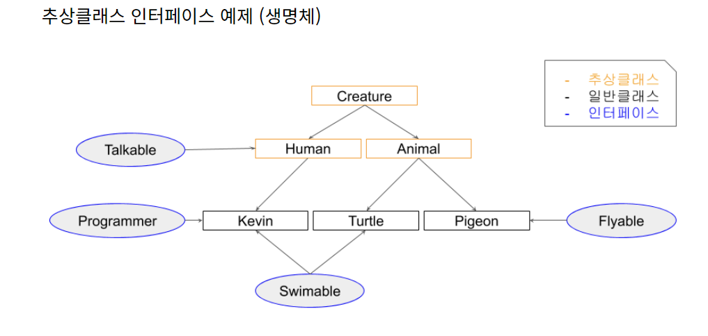

# 추상클래스 VS 인터페이스 왜 사용할까? 

## 추상클래스란? 
- 추상클래스는 일반 클래스와 별 다를 것이 없다. 단지, 추상 메서드를 선언하여 ___상속을 통해서 자손 클래스에서 완성하도록 유도___ 하는 클래스입니다.
그래서 미완성 설계도라고도 표현한다. <U>상속을 위한 클래스이기 때문에 따로 객체를 생성할 수 없다.</U>  
class 앞에 " abstract" 예약어를 사용하여 상속을 통해서 구현해야 한다는 것을 알려주고 선언부만 작성하는 추상메서드를 선언할 수 있다. 

```java
abstract class 클래스이름(){
    //...
    public abstract void 메서드이름();
}
```
## 인터페이스란?
- 추상클래스가 미완성 설계도라면 인터페이스는 ___기본 설계도___ 라고 할 수 있다. 인터페이스도 추상클래스처럼 다른 클래스를 작성하는데 도움을 주는 목적으로 작성하고 클래스와 다르게 다중상속(구현)이 가능하다.
```java
interface 인터페이스이름(){
    public static fuinmal 상수이름 = 값;
    public abstract void 메서드이름();
}
```

## 추상클래스 VS 인터페이스 차이점
- 추상클래스와 인터페이스의 공통점은 추상메서드를 사용할 수 있다는 것이다.  
___그럼 굳이 왜 2가지로 나눠서 사용할까?___ 추상클래스와 인터페이스의 기능들을 살펴보면 ___추상클래스가 인터페이스의 역할을 다 할 수 있는데 왜 굳이 인터페이스라는게 있는 걸까요?___  
이론적인 차이점을 다 제외하고 두개로 나눠서 사용하는 가장 큰 차이점은 ___사용용도___ 라고 일 수 있다.

### 1. 사용의도 차이점

- ___추상클래스는 IS -A " ~이다."___
- ___인터페이스는 HAS -A "을 할 수 있는"___
- 이렇게 구분하는 이유는 다중상속의 가능 여부에 따라 용도를 정한 것 같다.  
자바의 특성상 한개의 클래스만 상속이 가능하여 해당 클래스의 구분을 추상클래스 상속을 통해 해결하고, 할 수 있는 기능들을 인터페이스로 구현한다.  

### 2. 공통된 기능 사용 여부
- 만약 모든 클래스가 ___인터페이스를 사용해서 기본 틀을 구성한다면... 공통으로 필요한 기능들도 모든 클래스에서 오버라이딩 하여 재정의 해야하는 번거로움이 있다.___  
이렇게 공통된 기능이 필요하다면 추상클래스만 사용하면 되는거 아닌가요 ? 위에서 얘기 햇듯이 자바는 하나의 클래스만 상속이 가능하다. 만약 각각 다른 추상클래스를 상속하는데 공통된 기능이 필요하다면?  
해당 기능을 인터페이스로 작성해서 구현하는게 편할것이다.


위와 같은 관계를 갖는 예제를 만들어 보겠습니다. 인간과 동물은 생명체를 상속하고 각 생명체들은 구분에 따라 인간과 동물을 상속한다.  
그리고 각각 할 수 있는 기능들을 인터페이스로 구현했다. 

