# Heap 

- 자료구조 사이에 Heap을 설명하는 이유
  - <b>'우선순위' 큐가 바로 힙 자류 구조를 이용하여 구현 되기 때문.</b>
## 1. Heap 이란  무엇인가?
  - 힙은 <b>최소값 또는 최대값을 빠르게 찾아내기 위해 완전이진트리 형태로 만들어진 자료구조 이다.</b>
  - 키워드는 "취소값, 최대값", '빠르게',"완전이진트리" 이다.  
    - 완전 이진트리?? 
      - 기본적으로 트리(tree)란?  
        - 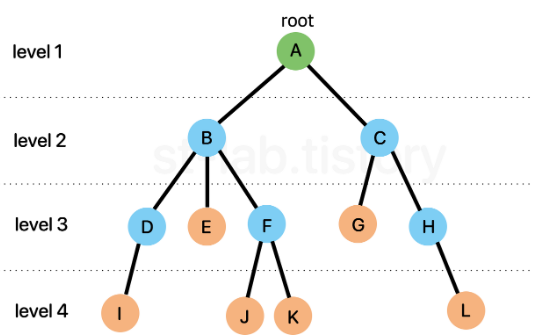    
        위와 같은구조를 Tree 구조라고 한다. 위 그림을 거꾸로 보면 나무 같이 생겨서 tree 구조라고 한다.  
        여기서 몇 가지 알아야 할 것이 있다. 이부분만 짚자면 아래와 같다.    
        - 부모 노드 (parent node) : 자기 자신이(노드)과 연결 된 노드 중 자신보다 높은 노드를 의미(ex. F의 부모노드: B).  
        - 자식 노드 (child node) : 자기 자신(노드)과 연결 된 노드 중 자신보다 낮은 노드를 의미 (ex.C의 자식노드 : G.H)  
        - 루트 노드 (root node) : 일명 뿌리 노드라고 하며 루트 노드는 하나의 트리에선 하나밖에 존재하지 않고, 부모노드가 없다. 위 이미지에선 녹색이 뿌리 노드이다.  
        - 단말 노드 (leaf node) : 리프 노드라고도 불리며 자식 노드가 없는 노드를 의미한다. 위 이미지에서 주황색 노드가 단말 노드다.  
        - 내부 노드 (internal node) : 단말 노드가 아닌 노드  
        - 형제 노드 (sibling node) : 부모가 같은 노드를 말한다. (ex. D,E,F는 모두 부모노드가 B이므로 D,E,F는 형제 노드다.)  
        - 깊이 (depth) : 특정 노드에 도달하기 위해 거쳐가야 하는 '간선의 개수'를 의미 (ex.F의 깊이 : A -> B -> F 이므로 깊이는 2가 됨)  
        - 레벨 (level) : 특정 깊이에 있는 노드들의 집합을 말하며, 구현하는 사람에 따라 0 또는 1부터 시작한다. (ex. E,E,F,G,H)  
        - 차수 (degree) : 특정 노드가 하위(자식) 노드와 연결 된 개수 (ex. B의 차수 = 3{D,E,F} )
        정도로만 알고 있으면 된다.  
      - 위 트리 구조에서 특정한 형태로 제한을 하게 되는데, <b>모든 노드의 최대 차수를 2로 제한한 것이다.</b>  
      노드는 자식노드를 최대 2개 까지 밖에 못 갖는 것이다. 이를 <b>이진 트리(Binary Tree)</b> 라고 한다.    
      위의 이미지에서는 B노드가 차수가 3이므로 이진트리가 아니다. 즉, 이진트리의 경우 다음과 같은 형태를 띈다.   
      - 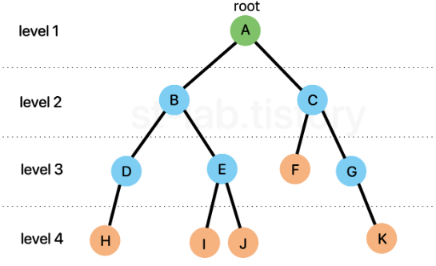  
      - 그럼 완전 이진 트리(complete binary tree)에서 '완전'이라는 것은 무엇인지 알아보아야 한다.  
        - 완전 이진트리란 ? 
          - '마지막 레벨'을 제외한 모든 노드가 채워져 있으면서 모든 노드(=사실상 마지막 레벨의 노드들)가 왼족부터 채워져 있어야 한다.  
          - 이진트리에서 두 가지 조건을 더 만족해야 하는 것이다.  
            1. 마지막 레벨을 제외한 모든 노드가 채워져 있어야함.
            2. 모든 노드들은 왼쪽부터 채워져 있어야함.  
          - 그리고 완전 이진트리에서 한 가지 더 조건을 추가하면 '포화 이진 트리 (perfect binary tree)가 된다.    
          바로 "마지막 레벨을 제외한 모든 노드는 두 개의 자식 노드를 갖는다."는 조건이다.  
          - 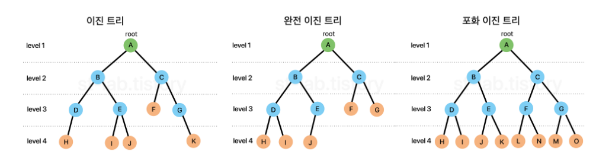  
        - 그럼 힙은 어떻게 구현이 될까?  이 부분이 가장 큰 문제이다. 최대값 혹은 최소 값을 어떻게 빠르게 찾아낼 수 있는가?  
        - 어떤 리스트에 값을 넣었다가 빼내려고 할 때, 우선 순위가 높은 것 부터 빼내려고 한다면 대게 정렬을 떠올리게 된다.    
        쉽게 생각해서 숫자가 낮을 수록 우선순위가 높다고 가정할 때 매 번 새 원소가 들어올 때 마다 이미 리스트에 있던 원소들과 비교를 하고 정렬을 해야 한다.  
        문제는 이렇게 하면 비효율적이기 때문에 좀 더 효율이 좋게 만들기 위하여 다음과 같은 조건을 붙였다.   
        <b> 부모 노드는 항상 자식 노드보다 우선 순위가 높다</b>   
        즉, 모든 요소들을 고려하여 우선순위를 정할 필요 없이 <b style="color:orange">부모 노드는 자식 노드보다 항상 우선순위가 앞선다는 조건만 만족시키며 완전이진트리 형태로 채워나가는 것이다.</b>  
        - 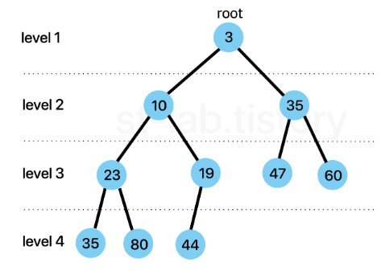    
        이것을 조그만 돌려서 생각해보면 루트 노드(root node)는 항상 우선 순위가 높은 노드라는 것이다.
        이러한 원리로 최대값 혹은 최소값을 빠르게 찾아낼 수 있다면 장점 (시간 복잡도 : O(1))과 함께 삽입 삭제 연산시에도 부모노드가 자식노드보다 우선순위만 높으면 되므로 결국 트리의 깊이만큼만 비교를 하면 되기 때문에 O(logN)의 시간복잡도를 갖아 매우 빠르게 수행 할 수 있다.  
        - 그리고 위 이미지에서도 볼 수 있지만 부모노드와 자식노드간의 관계만 신경쓰면 되기 때문에 <b>형제 간 우선 순위는 고려되지 않는다.</b>  
        이러한 정렬 상태를 흔히 '반 정렬 상태' , '느슨한 정렬 상태', 약한 힙(weak heap)이라고도 불린다.  
        - 그럼 왜 형제간의 대소비교가 필요 없는가?
          - 우선 순위가 높은 순서대로 뽑는 것이 포인트다. 즉 , 원소를 넣을 때도 우선 순위가 높은 순서대로 나올 수 있도록 유지가 되야하고 뽑을 때 또한 우선순위가 높은 순서 차례대로 나오기만 하면 된다. 
          

### heap의 종류
- 앞서 힙은 우선 순위가 높은 순서대로 나온다고했다. 이 말은 어떻게 우선순위를 매기냐에 따라 달라지겠지만, 기본적으로 정수, 문자, 문자열 같은 경우 언어에서 지원하는 기본 정렬 기준들이다.  
예로 정수나 문자의 경우 낮은 값이 높은 값보다 우선한다.  
예로 {3,1,6,4} 를 정렬한다고 하면 낮은 순서대로 {1,3,4,6}이렇게 정렬하게 된다.  
이렇게 정렬되는 순서, 즉 기본적으로 어떤 것을 우선 순위가 높다고 할지에 따라 두 가지로 나뉜다.   
- 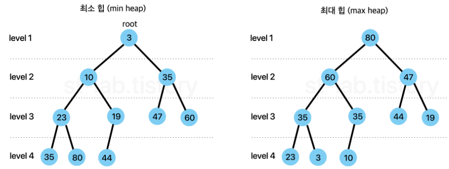    
  - 최소 힙 : 부모 노드의 값(key 값) =< 자식 노드의 값 (key 값)
  - 최대 힙 : 보무 노드의 값(key 값) =< 자식 노드의 값 (key 값)  
- 이렇게 두 가지로 나뉜다.    
다만, 여기서 가장 기본으로 우선순위를 뽑는다고 하면 보통 " 오름차순" 을 생각하기도 하고 많은 언어들도 오름차순을 기본으로 하기 때문에 '최소 힙'을 구현해보기로 한다.  
  (최대 힙의 경우 비교연산자만 바꿔주면 되기 때문에 어떤 것을 구현하더라도 크게 문제가 없다.)  
- 그럼 위의 트리 구조를 어떻게 구현할 것인가?  
  - 가장 표준적으로 구현되는 방식은 '배열'이다. 물론 연결리스트로도 구현이 가능하지만, 문제는 특정 노드의 '검색', '이동' 과정이 조금 더 번거롭기 때문이다.  
  - 배열의 경우는 특정 인덱스에 바로 접근할 수가 있기 때문에 좀 더 효율적이기도 하다.  
      
- 배열로 구현하게 되면 특징 및 장점들이 있다. 아래 그림 참조.
  - 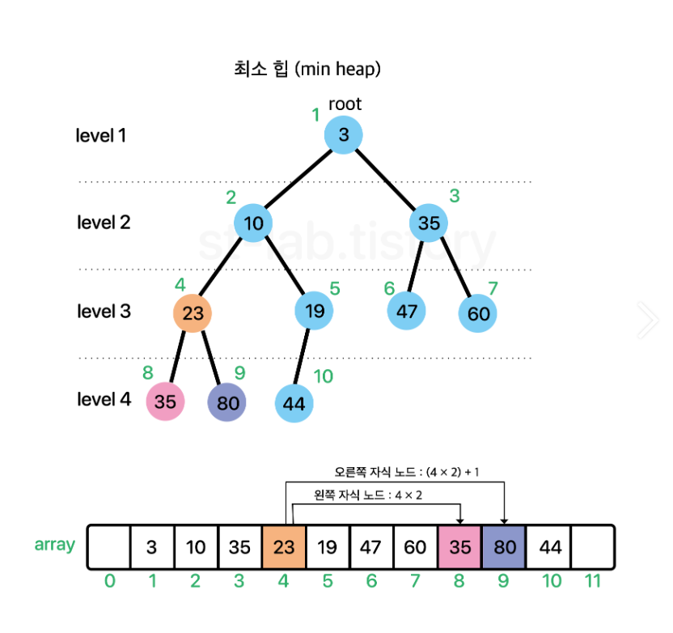  
  1. 구현의 용이함을 위해 시작 인덱스(root)는 1부터 시작한다.
  2. 각 노드와 대응 되는 배열의 인덱스는 '불변한다.'  
  위 특징을 기준으로 각 인덱스별로 채워 넣으면 특이한 성질이 나오는데 다음과 같다.
- 성질
  1. 왼쪽 자식 노드 인덱스 = 부모 노드 인덱스 x 2 
  2. 오른쪽 자식 노드 인덱스 = 부모 노드 인덱스 x2 + 1
  3. 부모 노드 인덱스 = 자식 노드 인덱스 /2  
  위 세개의 법칙은 절대 변하지 않는다.  
  예를 들어 index 3의 왼쪽 자식 노드를 찾고 싶다면 3 x2를 해주면 된다.즉 index 6 이 index 3의 자식 노드라는 것이다.  
  반대로 index 5의 부모 노드를 찾고 싶다면 5/2 를 해주면 된다. (몫만 취함)그러면 2이므로 index 2가 index5의 부모노드라는 것이다.
  * 
  * Heap의 삽입은 크게 두 가지로 나뉜다.
  * 1. 사용자가 Compartor을 사용하여 정렬 방법을 Heap 생성단계에서 넘겨 받은 경우 (comparator가 null이 아닌 경우 )
  * 2. 클래스 내에 정렬 방식을 Comprable로 구현했거나 기본 정렬 방식을 따르는 경우 (comparator가 null인 경우)
  * 
  * 이 두 가지로 나누어 봐야한다.
  * 
  * 기본적으로 Heap에 원소가 추가되는 과정은 다음과 같다.
  * 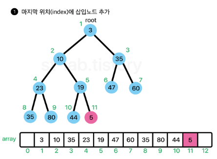
  * 
  * 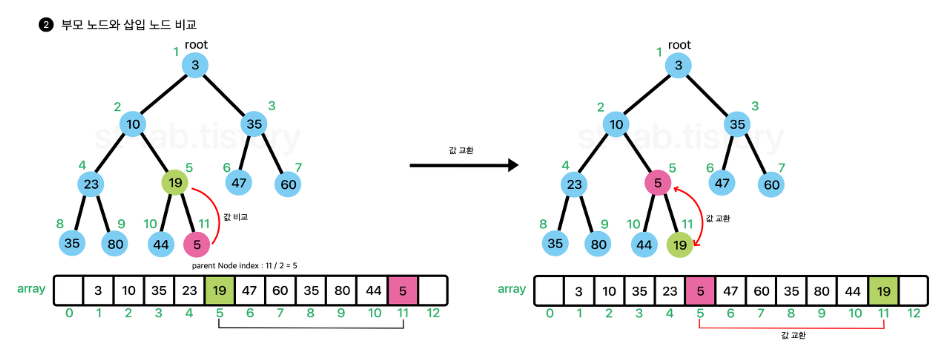  
  * 
  * 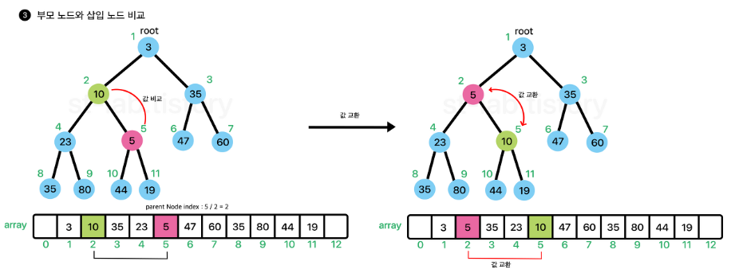
  * 
  * 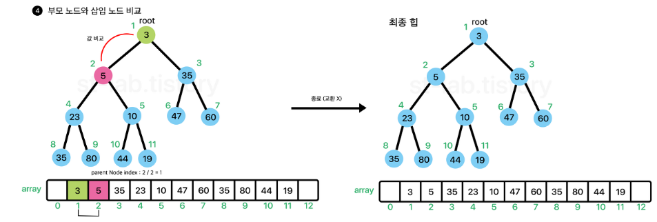
  - 즉, 배열의 마지막 부분에 원소를 넣고 부모노드를 찾아가면서 부모 노드가 삽입 노드보다 작을 때 까지 
  요소를 교환해가면서 올라간다. 위 과정을 흔히 위로 올라가면서 선별한다고 하여 sift-up(상향 선별) 이라고 한다.  
- 즉 값을 추가할 때는 size +1 위치에 새로운 값을 추가하고 상향 선별 과정을 거쳐 '재배치'를 해준다고 생각하면 된다. 
이 때, 재배치 되는 노드를 위 <b style="color:pink"> 분홍색 노드</b>, 즉 타겟 노드(target)라고 생각하면 된다.

- Add.
  - 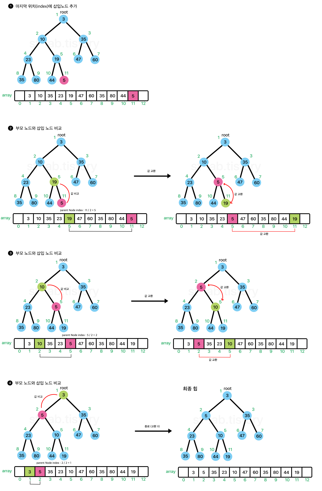   
- Remove
  - 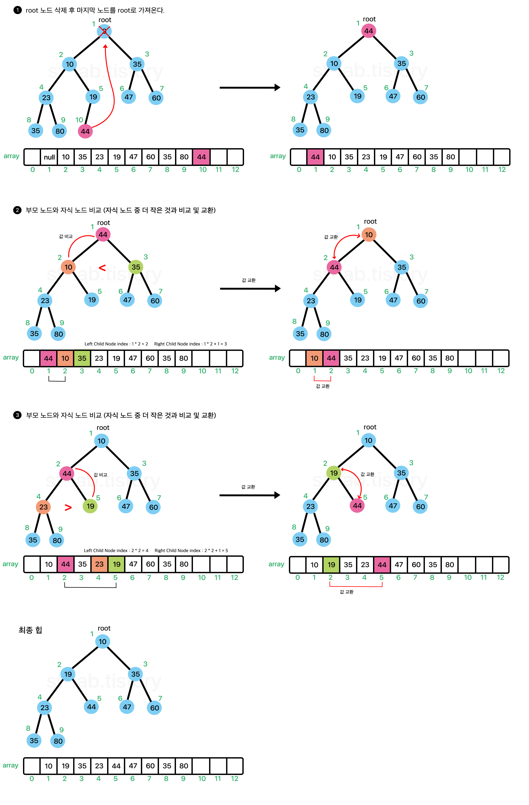   
  - 