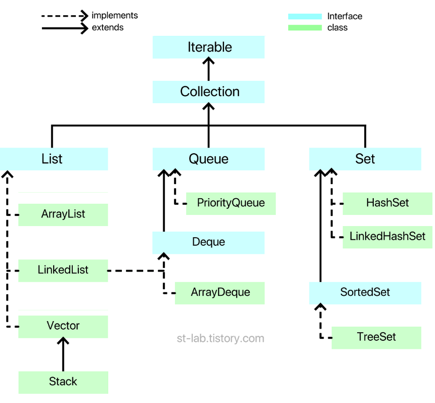
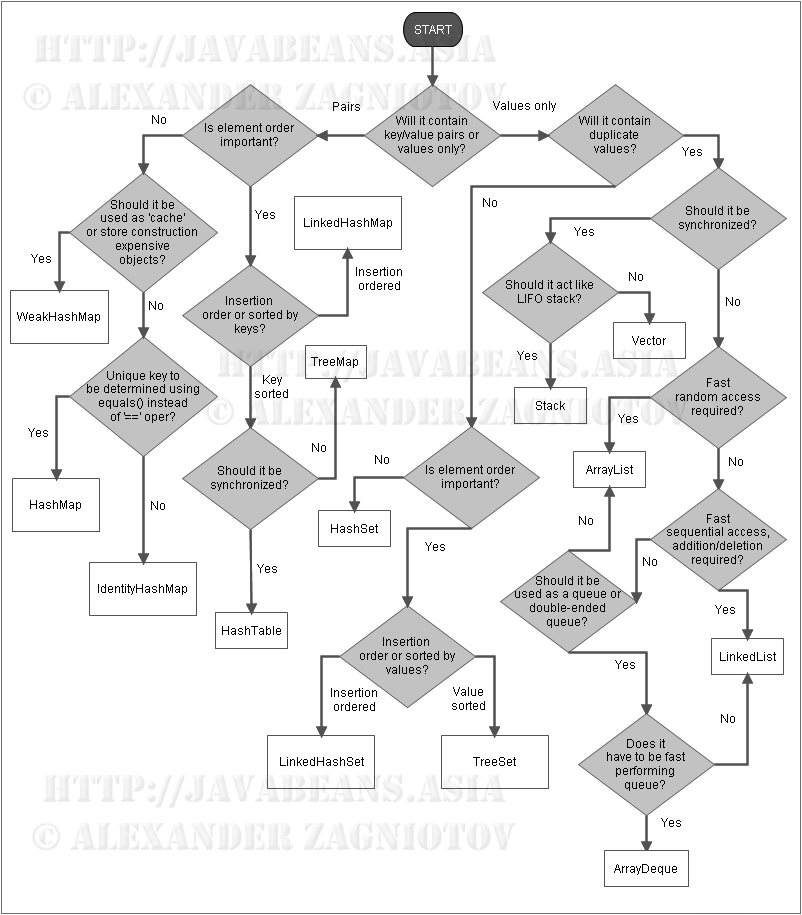

## 자바 - 자바 컬렉션 프레임워크 (Java 컬렉션 프레임 워크 )

- 기본적인 자료 구조에 대해서 정리.
- 자료구조는 Data Structure ( 데이터 구조 ) 라고 한다. '일련의 일정 타입들의 데이터 모임 또는 관계를 나타낸 구성체'.
- 자료구조와 알고리즘은 의존적인 관계이기 때문에 자료구조에 대한 이해가 필요. ( 문제해석-> 자료구조 선택 )  
  ex) insert/add, remove/delete 가 빈번하게 일어난다면 LinkedList를 아닐 경우 ArrayList를 쓰듯 자료 구조별 장단점이 상이함.
- 자바 컬렉션 프레임 워크는 표준 라이브러리로 다양한 자료구조를 지원하고 있는 것.

### 자료구조의 분류

- 대표적으로 선형 자료구조 (Linear Data Structure)와 비선형 자료구조(Nonlinear Data Structure)로 나뉠 수 있다.
- 형태에 따른 자료구조 라고 보고, 각 자료구조에 알맞게 구체화 된 것들을 '구현된 자료구조'라고 한다.
    - 선형 자료구조 (Linear Data Structure)
        - 선형 자료구조는 데이터가 일렬로 연결된 형태.  (int[] 와 같은 것).
        - 대표적으로 List, Queue, Deque이 있다.
    - 비선형 자료구조 (Nonlinear Data Structure)는 선형 자료구조의 반대다.
        - 일렬로 나열된 것이 아닌, 각 요소가 여러 개의 요소와 연결된 형태를 생각하면 된다. 쉽게 생각해서 거미줄 같다고 보면 된다.
        - 대표적인 비선형 자료구조는 그래프(Graph)와 트리(Tree)가 있다.
    - 위 두가지에 해당하지 않는 자료구조로는 집합(Set)이 있다. 보통 기타 자료구조 또는 집합 자료구조라고 본다. 집합의 경우는 데이터가 연결 된 형식이 아니다. 필자의 경우 집합(Set)은 table에
      가까운 자료구조라고 보고 있다.
    - 파일 자료구조도 있지만 순차파일, 색인파일, 직접파일 등이 있고 위의 자료구조들과는 조금 다르다.

----

### Java Collection FrameWork

- Java Colleciton Framework의 의미, 일정 타입의 데이터들이 모여 쉽게 가공 할 수 있도록 지원하는 자료구조들의 뼈대(기본 구조)라는 의미이다.
- 기본 구조라고 하면 Interface 이다. 인터페이스 자체가 기본 뼈대(추상 구조)만 있지 않은가,  
  이렇듯 실제로 자바에서 제공하는 Collection은 크게 3가지 인터페이스로 나뉘어 있다.  
  크게 List(리스트), Queue(큐), Set(집합)으로 나뉘어 있다. 앞서 설명한 '형태에 따른 자료구조'라고 보면 된다.  
  그리고 각 분야별로 '구현'된 것들이 있다.  
  
- 점선은 구현 관계이고, 실선은 확장 관계이다.(인터페이스끼리는 다중 상속이 가능하다.) 또한 Collection을 구현한 클래스 및 인터페이스들은 모두 java.util패키지에 있다.

- `List`, `Queue`, `Set` 이 3가지의 형태에 따른 자료구조들이 있다. 그리고 `Queue`와 `Set`에는 조금 더 구체화 되어 `Deque`와 `SortedSet`이라는 형태에 따른 자료구조가
  있는 것이다.  
  그리고 이 형태에 따른 자료구조들은 각각 '구현'이 되어 `class`로 제공된다. 바로 녹색 부분이 '구현된 자료구조'라고 보면 된다.
- 자바에서 `InterFace`를 `class`파일에서 쓰면 보통 '구현한다'라고 한다.  
  여기서 `Iterable` 은 `Iteration`이라는 '반복','되풀이'를 의마하는 단어인데, `Iterable`이라고 하면 __반복 가능한__ 정도로 생각하면 된다.  
  왜 Collection 상위에 `Iterable`이 있는것일까? 저기서 제공하는 있는 `class`들은 모두 객체형태로 내부 구현 또는 대개 `Object[]`배열 형태가 아니라 각각의 객체를 갖고 움직인다.  
  그래서 객체의 데이터들을 모두 순회하면서 출력하려면 사용자들이 각각의 데이터 순회 방법을 알거나 하나씩 `get()`같은 메소드를 통해서 하나씩 꺼내야한다.  
  하지만 `Iterable`에서는 인터페이스를 보면 알 수 있겠지만, `for-each`를 제공한다. 즉,  `Iterable` 인터페이스를 쓰는 모든 클래스들은 기본적으로 `for-each` 문법을 쉽게 사용할
  수 있다.  
  이 말은 즉 반복자로 구현되어 나오게 하는 것이다.
- 참고로 Map에 대해서 Colleciton 이라고 볼 수 있다.  
  이것은 관점 차이이지만, 일단 Java에서는 Collection 이라고 보지 않는다.  
  아래 링크를 Collections API 에 대한 FAQ에서 왜 Map이 Colletion Interface를 상속하지 않는지 설명한다.

> [JavaCollection](https://docs.oracle.com/javase/8/docs/technotes/guides/collections/designfaq.html#a14);  
> [내용 원문 ]
> why doesn't Map extend Collection? This was by design.  
> We feel taht mappings are not collections and collections are not mappings.  
> Thus, it makes little sense for Map to extend the Colleciton interface( or vice versa).
>
> 즉, 매핑(mapping)이 collections 라고 보기 힘들고, collections 또한 mapping 이라고 보기 힘들다는 것.  
> 그렇기 때문에 의도적으로 Collections Interface 를 상속하지 않았다는 뜻이다.
>
> 그리고 Collection Interface와 Map Interface의 호환성 문제도 있다.
>1. Collection Interface를 보면 이를 상속하여 구현된 클래스들은 모두 단일 데이터를 처리하지만,  
    > Map은 키(key)와 데이터(value)가 쌍으로 이루며 처리하기 때문에 굳이 Map을 위해 Collection 에서 Map과 관련한 메서드를 만들고 Map에서 Collection을 상속할 필요가 없다.
>
>2. Iterable Interface와 Map간의 문제도 있다. 위에 언급했듯이 iterable은 반복가능한 형태를 의미한다고 했다.  
    > 그런데 Map은 구조상 키(key)에 대응되는 값(value)이라는 특징을 갖고 있는데, 반복자로 뱉기 위해서는 key와 value중 어느것으로 반복할 것인가?  
    > 즉 ,Iterable Interface의 iterator() 구현함에도 문제가 발생할 수 밖에 없다.(그래서 내부적으로 key와 value의 별도 인터페이스도 있다.)
>3. Java에서는 상속이라는 모델링 자체가 한가지 유형의 공통성을 모델링 한다는 것에 의미가 있는데 위 1번, 2번 이유 모두 상속과는 거리가 멀다.
>4. Map은 의미적으로는 Collection이 맞을 수는 있으나 Java에서는 Collection이라고 보진 않는다.
-----

### List  [리스트]

- List Interface는 대표적인 선형 자료구조로 주소 순서가 있는 데이터를 목록으로 이용할 수 있또록 만들어진 인터페이스이다.  
  좀 더 쉽게 얘기하자면 우리가 배열에서 쓸때 int[] array = new int[10]; 처럼 쓴다. 하지만, 이처럼 선언한 배열의 경우 10개의 공간 외에는 더이상 사용하지 못한다.  
  즉, array[13] = 32; 라고 해주더라도 할당된 크기(범위) 밖이기 때문에 IndexOutofBoundsException 이라는 에러가 발생한다.

이러한 단점을 보완하여 List를 통해 구현된 클래스들은 '동적 크기'를 갖으며 배열처럼 사용할 수 있게 되어있다.  
배열의 기능 + 동적 크기 할당이 합쳐져 있다고 보면 된다.

<List Interface를 구현하는 클래스>

1. ArrayList
2. LinkedList
3. Vector( +Vector를 상속받은 Stack)
4. <List Interface에 선언된 대표적인 메서드>

|메서드|리턴 타입|설명|
|-----|-------|----|
|add(E e)|boolean|요소를 추가합니다.|
|remove(Object o)| boolean| 지정한 객체와 같은 첫 번째 객체를 삭제한다.|
contains(Object o)|boolean| 지정한 객체가 컬렉션에 있는지 확인한다. 있을경우 True, 없을 경우 False를 반환한다.|
|size()|int| 현재 컬렉션에 있는 요소 개수를 반환한다.|
|get(int index)|E| 지정된 위치에 저장된 원소를 반환한다.|
|set(int index, E elements)|E| 지정된 위치에 있는 요소를 지정된 요소로 바꾼다.
|isEmpty()|boolean|현재 컬렉션에 요소가 없다면 true를, 요소가 존재한다면 false를 반환한다.|
|equals(Object o) | boolean| 지정된 객체와 같은지 비교한다.|
|indexOf(Object o)| int| 지정된 객체가 있는 첫 번째 요소의 위치를 반환한다. 만일 없을 경우 -1을 반환 한다.|
|clear()| void| 모든 요소들을 제거한다.|  

- List를 구현하는 각 클래스들은 조금씩 특징이 다르다.
    1. __ArrayList__ 는 Object[]배열을 사용하면서 내부 구현을 통해 동적으로 관리를 한다.  
       우리가 흔히 사용하는 primitive 배열(ex int[])과 유사한 형태라고 보면 된다.  
       즉, 최상위 타입인 Object 타입으로 배열을 생성하여 사용하기 때문에 요소 접근(Access elements)에서는 탁월한 성능을 보이나,  
       중간의 요소가 삽입, 삭제가 일어나는 경우 그 뒤의 요소들은 한 칸씩 밀어야 하거나 당겨야 하기 때문에 삽입, 삽입 삭제에서는 비효율적인 모습을 보인다.
    2. __LinkedList__ 는 데이터(item)와 주소로 이루어진 클래스를 만들어 서로 연결하는 방식이다. 데이터와 주소로 이루어진 클래스를 Node라고 하는데,  
       각 노드는 이전의 노드와 다음 노드를 연결하는 방식인 것이다. (이중 연결 리스트라고도 한다.)  
       즉, 객체끼리 연결한 방식이다. 이렇다보니 요소를 검색해야 할 경우 처음 노드부터 찾으려는 노드가 나올 때 까지 연결된 노드들을 모두 방문해야하는 점에서 성능이 떨어지나,  
       해당 노드를 삭제, 삽입해야 할 경우 해당 노드의 링크를 끊거나 연결만 해주면 되기 때문에 삽입, 삭제에서는 매우 좋은 효율을 보인다.
    3. __Vector__ 는 자바를 배울때 그리 자주 보이지는 않는 클래스인데, 기본적으로 ArrayList와 거의 같다고 보면 된다.  
       Object[] 배열을 사용하며 요소 접근에서 빠른 성능을 보인다. 근데 왜 Vector가 있는 것이냐? 라고 한다면,  
       원래 Vector는 Collection Framework가 도입되기 전부터 지원하던 클래스였다. 그리고 Vector의 경우 항상 __동기화__ 를 지원한다.  
       쉽게 말하면 여러 쓰레드가 동시에 데이터에 접근하려면 순차적으로 처리하도록 한다.  
       그렇다보니 멀티 쓰레드에서는 안전하지만, 단일 스레드에서도 동기화를 하기 때문에 ArrayList에 비해 성능이 약간 느리다.
    4. __Stack__ 은 우리가 흔히 생각하는 것처럼 쌓아 올리는 것이다. 전문 용어로는 LIFO(Last in First Out )또는 후입선출이라고도 한다.  
       쉽게 생각하면 우리가 짐을 쌓는다고 가정하자, 짐을 쌓아올릴 때 가장 마지막에 쌓은 짐이 가장 위에 있을 것이다.  
       그리고 짐을 뺄 때에도 가장 위에 있는 짐부터 빼게 될 것이다. 가장 대표적인 예시로는 웹페이지에 있는 "뒤로가기"가 있다.  
       우리가 새로운 페이지로 넘어갈 때마다 넘어가기 전 페이지를 스택에 쌓고, 만약 뒤로가기로 누른다면 가장 위에 있는 페이지부터 꺼내오는 방식이다.  
       참고로 Stack의 경우 Vector클래스를 상속 받고 있고, java에서 지원하는 Stack 클래스의 메서드들도 뜯어보면 알 수 있지만,  
       모두 Vector에 있는 메서드를 이용하여 구현되고 있어 크게 다를 것은 없다.


- 리스트의 객체 생성 방법이다.

 ```java
import java.util.LinkedList;
import java.util.Stack;
import java.util.Vector;

class Ex {
    /*
     * T는 객체 타입을 의미하여 기본적으로
     * Integer, String Double, Long 같은 Wrapper Class 부터 사용자 정의 객체까지 가능하다.
     * ex) LinkedList<Integer> list = new LinkedList<>();
     * primitive type은 불가능하다.
     */
    //방법 1
    ArrayList<T> arraylist = new ArrayList<>();
    LinkedList<T> linkedList = new LinkedList<>();
    Vector<T> vector = new Vector<>();
    Stack<T> Stack = new Stack<>();

    //방법2
    List<T> arraylist = new ArrayList<>();
    List<T> linkedList = new LinkedList<>();
    List<T> vector = new Vector<>();
    List<T> Stack = new Stack<>();

    // Stack은 Vector를 상속하기 때문에 아래와 같이 설명할 수 있다.
    Vector<T> stack = new Stack<>();
}
```

- new 라는 생성자 뒤에 객체를 명시해주기 때문에 상위 타입인 `List<T>` 로 해주어도 무방하다.
- 만약 부득이하게 List종류를 중간에 바궈야하는 경우가 있을 경우 `List<T>`로 선언해주면 된다.

----

### Queue  [큐]

- Queue Interface(큐 인터페이스)는 선형 자료구조로 주로 순서가 있는 데이터를 기반으로 '선입선출,FIFO'를 위해 만들어진 인터페이스이다.  
  흔히 Stack(스택)과 많이 비교를 하는 자료구조이다 . 큐에 대해 간단하게 말하자면 10,20,30,40 순으로 데이터를 넣고, 데이터를 꺼낼 때 (poll) 넣은 순서 그대로 10,20,30,40이 나오는
  구조라는 것이다.  
  이 때 가장 앞쪽에 있는 위치를 head(헤드)라고 부르고, 가장 후위(뒤)에 있는 위치를 tail(꼬리)라고 부른다. 놀이기구에 대기줄을 상상하면 된다.
- Collection의 구조를 보면 알겠지만, Queue를 상속하고 있는 Deque(덱)이라는 Interface도 있다. 둘 다 같은 분류인데,  
  Queue는 한쪽 방향(단방향)삽입 삭제가 가능한 반면, Deque는 Double ended Queue 라는 의미로 양쪽에서 삽입삭제가 가능한 자료 구조라고 보면 된다.  
  즉, head에서도 접근 가능하며, tail에서도 접근이 가능한 양방향 큐라고 보면 된다. (Queue에서 확장된 형태)  
  쉬운 예로는 카드 덱(deck)을 생각하면 된다. 카드를 중간에서 뺄 수는 없고, 맨 위에 놓거나, 맨 아래에 놓거나 맨 위에 것을 빼거나, 맨 아래 것을 뺄 수 있는 것이라 생각하면 된다.


- Queue/ Deque Interface를 구현하는 클래스
    1. LinkedList
    2. ArrayDeque
    3. PriorityQueue
- Queue /Deque Interface에 선언된 대표적인 메소드

|Deque|Queue|메소드|리턴타입|설명|
|----|----|----|----|----|
|Deque|Queue|add(E e)| boolean| 요소를 꼬리에 추가한다. 만약 큐가 모두 찼을 경우 IllegalStateException 예외를 던진다.|
|Deque|Queue|Offer(E e)|boolean| 요소를 꼬리에 추가한다. 큐가 모두 차더라도 IllegalStateException을 던지지 않는다.|
|Deque|Queue|peek()| E|헤드를 삭제하지 않고 검색하여 요소를 반환 합니다.|
|Deque|Queue|poll()|E|헤드를 검색 및 삭제하면서 요소를 반환한다.|
|Deque| |addLast(E e)|void|요소를 꼬리에 추가, 만약 큐가 모두 차면 IllegalStateException을 던진다. (=add(E e)와 같다.)|
|Deque| |addFirst(E e)|void|요소를 헤드에 추가, 만약 큐가 모두 차면 IllegalStateException을 던진다. |
|Deque| |offerLast(E e)|boolean| 요소를 꼬리에 추가한다. offer(E e)와 같다.|
|Deque| |offerFirst(E e)|boolean| 요소를 헤드에 추가한다. |
|Deque| |peekFirst()|E |헤드에 있는 요소를 삭제하지 않고 반환한다. peek()과 같다.|
|Deque| |peekLast()|E|꼬리에 있는 요소를 삭제하지 않고 반환한다.|
|Deque| |pollFirst()|E| 헤드를 검색 및 삭제하면서 요소를 반환한다. poll()과 같다.|
|Deque| |pollLast()|E| 꼬리를 검색 및 삭제하면서 요소를 반환한다.
|Deque| |size()|int|요소의 개수를 반환한다.|

- 목록은 많아보이지만 단순히 Deque는 양방향이기 때문에 헤드와 꼬리를 나누어 메소드가 더 생성되었을 뿐이니 외울 것은 크게 없다.

- 왜 여기서도 `LinkedList`가 또 나오는가 ? 위 그림에서 볼 수 있듯이 `LinkedList`는 `List`를 구현하기도 하지만, Deque(덱)도 구현한다.  
  그리고 Deque Interface는 QueueInterface를 상속 받는다. 즉, LinkedList는 사실상 3가지 용도로 쓸 수 있다는 것이다.
    1. List
    2. Deque
    3. Queue

```java
import java.util.AbstractSequentialList;
import java.util.Deque;

public class LinkedList<E>
        extends AbstractSequentialList<E>
        implements List<E>, Deque<E>, Cloneable, java.io.Serializable {
    transient int size = 0;
    /*
     * Pointer to first Node.
     * */
    transient Node<E> first;

    /*
     * Pointer to last Node
     * */
    transient Node<E> last;

}
```

- 왜 LinkedList를 받을까? 이를 설명하기에는 조금 길어지니 간단하게 , 앞서 List 를 설명할 때도 말했지만, ArrayList와 LinkedList의 차이점은 Object[] 배열로 관리하느냐,
  Node 라는 객체로 연결하여 관리하느냐의 차이였다.  
  마찬가지다. __Deque 또는 Queue를 LinkedList처럼 Node 객체로 연결해서 관리하길 원한다면 LinkedList를 쓰면 된다__ 원리자체는 크게 다르지 않기 떄문에 LinkedList 하나에
  다중 인터페이스를 포함하고 있다.  
  반대로 ArrayList처럼 Object[]배열로 구현되어 있는 것 은 ArrayDeque이다. 물론 LinkedList와 ArrayDeque 둘 다 Deque를 구현하고 있고, Deque는 Queue를 상속받기
  때문에 Queue로도 쓰일 수 있다. 만약 여러분들이 자바에서 지원하는 컬렉션에서 '일반적인 큐'를 사용하고자한다면 LinkedList로 생성하여 Queue로 선언하면 된다.

```java
 Queue<T> queue=new LinkedList<>();
```

또한 Deque(덱)도 마찬가지다.

```java
Deque<T> queue=new LinkedList<>();
```
----
#### PriorityQueue는 뭘까?

- 단어 해석 그대로 '우선순위 큐'다. LinkedList는 Queue로 사용할 수 있다고 했다. 다만 큐의 원리가 선입선출이라는 전제 아래 짜여있다.  
  하지만 PriorityQueue는 '데이터 우선순위'에 기반하여 우선순위가 높은 데이터가 먼저 나오는 원리다.  
  따로 정렬방식을 지정하지 않는다면 낮은 숫자가 높은 순위를 갖는다. 쉽게 생각하면 정렬메소드인 sort()와 같은 순서로 데이터 우선순위를 갖는다는 의미다.  
  PriorityQueue는 주어진 데이터들 중 최댓값, 혹은 최솟값을 꺼내올 때 매우 유용하게 사용될 수 있다만,  
  다만 사용자가 정의한 객체를 타입으로 쓸 경우 반드시 Comparator또는 Comaprable을 통해 정렬 방식을 구현해주어야 한다. 각 클래스별 생성 방법

```java
 import java.util.ArrayDeque;
import java.util.LinkedList;
import java.util.PriorityQueue;
import java.util.Queue;

/*
 * T는 객체 타입을 의미하며 기본적으로
 * Integer, String, Double, Long 같은 Wrapper Classㄹ부터
 * 사용자 정의 객체까지 가능하다.
 * 단, primitive type은 불가능하다. */
class ex {
    ArrayDeque<T> arrayDeque = new ArrayDeque<>();
    PriorityQueue<T> priorityQueue = new PriorityQueue<>();

    Deque<T> arraydeDeque = new ArrayDeque<>();
    Deque<T> linkedListDeque = new LinkedList<>();

    Queue<T> arrayDeque = new ArrayDeque<>();
    Queue<T> linkedListDeque = new LinkedList<>();
    Queue<T> priorityQueue = new PriorityQueue<>();
}
```
----
### Set  [셋/세트]
- Set는 말 그대로 '집합'이다. Set의 가장 큰 특징이다. 라고하면 두가지가 있다.  
1. '데이터를 중복해서 저장할 수 없음.'
2. '입력 순서대로 저장 순서를 보장하지 않는다.'  
   ( 다만 LinkedHashSet은 Set임에도 불구하고 입력 순서대로 저장순서를 보장하고 있다. 그러나 데이터를 중복해서 저장할 수 없다는 것은 같다.)

- 기본적으로 List 꼐열은 index(Node)로 관리하기 때문에 add() 같은 메소드를 쓰면 순서대로 저장되었다.  
Queue 계열 또한 우선순위 큐(PriorityQueue)를 제외하고는 기본적으로 입력한 순서대로 객체가 연결되어 있다.  
하지만, Set의 경우는 일반적으로 입력받은 순서와 상관없이 데이터를 집합시키기 때문에 입력받은 순서를 보장할 수 없다.  
  
물론 순서 보장이 안된다는 불편함을 개선시키기 위해 만들어져 있는 것이 LinkedHashSet 이다. 만약 데이터 중복을 허용하고 싶지 않은데,  
입력 순서를 보장 받고 싶다면 LinkedHashSet을 사용하면 된다.

그리고 Queue와 유사하게 Set을 상속받고 있는 SortedSet Interface도 있다. 이름에서 어림짐작할 수 있으니 일단은 하나씩 천천히 알아보도록 하자.  
  
<Set/ SortedSet Interface를 구현하는 클래스>
1. HashSet
2. LinkedHashSet
3. TreeSet  

<Set / InterFace에 선언된 대표적인 메소드>  

|Sorted Set|Set|메소드|리턴타입|설명|
|----|----|----|----|----|
|Sorted Set|Set|add(E e)| boolean| 지정된 요소가 없을 경우 추가한다. 이미 지정된 요소가 존재하는 경우 false를 반환한다.|
|Sorted Set|Set|contains(Object o)|boolean|지정된 요소가 Set에 있는지를 확인한다. |
|Sorted Set|Set|equals(Object o)| boolean|지정된 객체와 현재 집합이 같은지를 비교한다. |
|Sorted Set|Set|isEmpty()|boolean |현재 집합이 비어있을 경우 true를, 아닐 경우 false를 반환한다. |
|Sorted Set|Set|remove(Object o)|boolean |지정된 객체가 집합에 존재하는 경우 해당 요소를 제거한다. |
|Sorted Set|Set|size|int |집합에 있는 요소의 개수를 반환한다. |
|Sorted Set|Set|clear()|void |집합에 있는 모든 요소들을 제거한다. |
|Sorted Set| |first(E e)|E |첫 번째 요소(가장 낮은 요소)를 반환한다. |
|Sorted Set| |last()|E |마지막 요소(가장 높으 ㄴ요소)를 반환한다. |
|Sorted Set| |headSet(E toElement)|SortedSet<E> |지정된 요소(toElement)보다 작은 요소들을 집합으로 반환한다. |
|Sorted Set| |tailSet(E fromElement)|SortedSet<E> |지정된 요소(fromElement)를 포함하여 큰 요소들을 집합을 반환한다. |
|Sorted Set| |subSet(E from, E to)|SortedSet<E> |지정된 from요소를 포함하여 form보다 크고, 지정된 to 요소보다 작은 요소들을 집합으로 반환한다. |  

- Set Interface를 구현하는 클래스들은 앞서 말했듯이 HashSet, LinkeHashSet, TreeSet 이렇게 3가지가 있다.
  - TreeSet은 Set Interface를 상속받은 SortedSet Interface를 구현하고 있다.
  - __Set의 가장 큰 특징__ 은 __"중복 되는 데이터를 넣지 못한다"__ 는 점이다.
  - ___"LinkedHashSet"을 제외___ 하고 대부분의 Set은 __"입력 순서대로의 저장순소를 보장하지 않는다."__
- 각 Set의 특징
1. __HashSet__ : 가장 기본적인 Set 컬랙션의 클래스인데, 입력 순서를 보장하지 않고, 순서도 마찬가지로 보장되지 않는다.  
그러면 어디에 쓰이는가?  
가장 쉽게 이해할 수 있는 예로는 우리가 게임에서 "닉네임"을 만든다던지 아이디를 생성할 때 "중복확인"을 눌러 중복된 닉네임 또한 아이디인지 확인하는 것이다.  
이는 데이터가 정렬되어있을 필요도 없고, 빠르게 중복되는 값인지만 찾으면 되기 때문에 유용한 방법이 될 수 있다.  
hash에 의해 데이터의 위치를 특정시켜 해당 데이터를 빠르게 색인(search)할수 있게 만든 것이다.  
즉, Hash 기능과 Set 컬렉션이 합쳐진 것이 HashSet이다. 그렇기 때문에 삽입, 삭제, 색인이 매우 빠른 컬렉셔 중 하나다.
2. __LinkeHashSet__ 의 경우 이름에서 알 수 있듯이 Link+ Hash+ Set이 결합된 형태다.  
LinkedList에서 보면 add()메서드를 통해 요소들을 넣은 순서대로 연결한다.  즉, LinkedList의 첫번째 요소부터 차례대로 출력하면 입력했던 순서대로 출력 된다는 것이고  이는 순서를 보장한다는 의미이다.  
Set의 경우 기본적으로는 입력 순서대로의 저장순서를 보장하지 않아, '중복은 허용하지 않으면서 순서를 보장 받고 싶은 경우'에는 불편할 수 밖에 없다.  
이를 보완하기 위해 존재하는 것이 LinkedHashSet인 것이다.  
실생활에서 그나마 예로 들자면 페이지를 열 때 만약 해당 페이지가 중복된 경우 Cache는 다시 적재할 필요는 없지만, 새로운 페이지를 할당해야 하는 경우 최근에 사용되지 않은 cache를 비우고자 할 때 ,가장 오래된 cache를 비우는 것이 현명할 것이다 .  
이를 LRU 알고리즘 (Least Recently Used Algorithm)이라고 하는데, 이럴 때 입력된(저장순) 순서를 알아야 오래된 캐시를 비울 수 있다. 이에 적용할 수 있는 자료구조 중 하나다.  
   (현실적으로는 LRU기법으로 LinkedHashMap이라는자료구조가 대부분을 차지하고 있어 많이 쓰이진 않으나 그나마 이해하기 쉬운 예이다.)
3. __TreeSet__ 은 HashSet과 마찬가지로 입력 순서대로의 저장 순서를 보장하지 않으며 중복 데이터 또한 넣지 못한다.  
다만 특별한 점이 있다면 SortedSet Interface의 이름을 보면 알 수 있듯 이를 구현한 TreeSet은 데이터의 '가중치에 따른 순서'대로 정렬되어 보장한다는 것이다.  
앞서 PriorityQueue를 생각해보자, 데이터들이 입력한 순서대로가 아닌 값에 따라 정렬되어 Queue에 담아진다.  
마찬가지로 TreeSet은 '중복되지 않으면서 특정 규칙에 의해 정렬된 형태의 집합을 쓰고 싶을 때 쓴다.' 정렬된 형태로 있다보니 특정 구간의 집합요소들을 탐색할 때 매우 유용하다.  
   (Tree라는 자료구조 자체가 데이터를 일정 순서에 의해 정령하는 구조다. 거기에 더해진 것이 바로 Set인 중복값 방지 자료구조인것이다.)
- 각 클래스별 생성 방법

```java
import java.util.HashSet;
import java.util.LinkedHashSet;
import java.util.TreeSet;

/* 
T는 객체 타입을 의미하며 기본적으로
Integer, String, Double, Long 같은 Wrapper Class부터
사용자 정의 객체까지 가능하다.
단, primitive type은 불가능하다.
*/
class ex {
    HashSet<T> hashSet = new HashSet<T>();
    LinkedHashSet<T> linkedHashSet = new LinkedHashSet<T>();
    TreeSet<T> treeSet = new TreeSet<>();
    
    SortedSet<T> treeset = new TreeSet<>();
    
    Set<T> hashset = new HashSet<>();
    Set<T> linkedhashset = new LinkedHashSet<>();
    Set<T> treeset = new TreeSet<>();
}
```
------
### 적절한 자료 구조 사용하기
- 자바에서 지원하는 대표적인 컬렉션 프레임워크 11가지
  1. ArrayList
  2. LinkedList
  3. Vector
  4. Stack
  5. Queue(by LinkedList)
  6. PriorityQueue
  7. Deque(by LinkedList)
  8. ArrayDeque
  9. HashSet
  10. LinkedHashSet
  11. TreeSet
12.   
