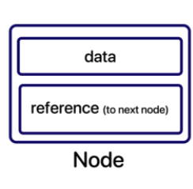
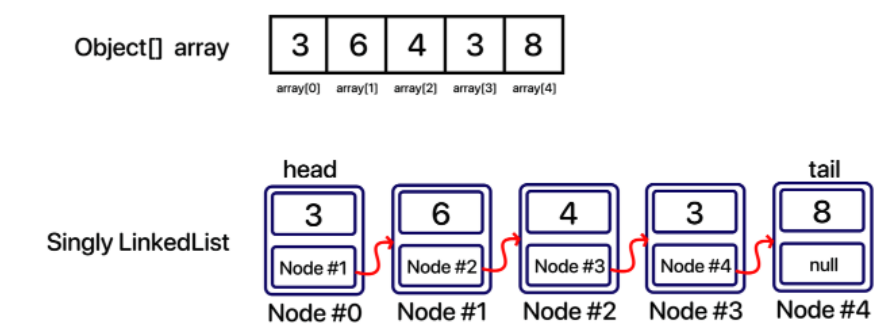
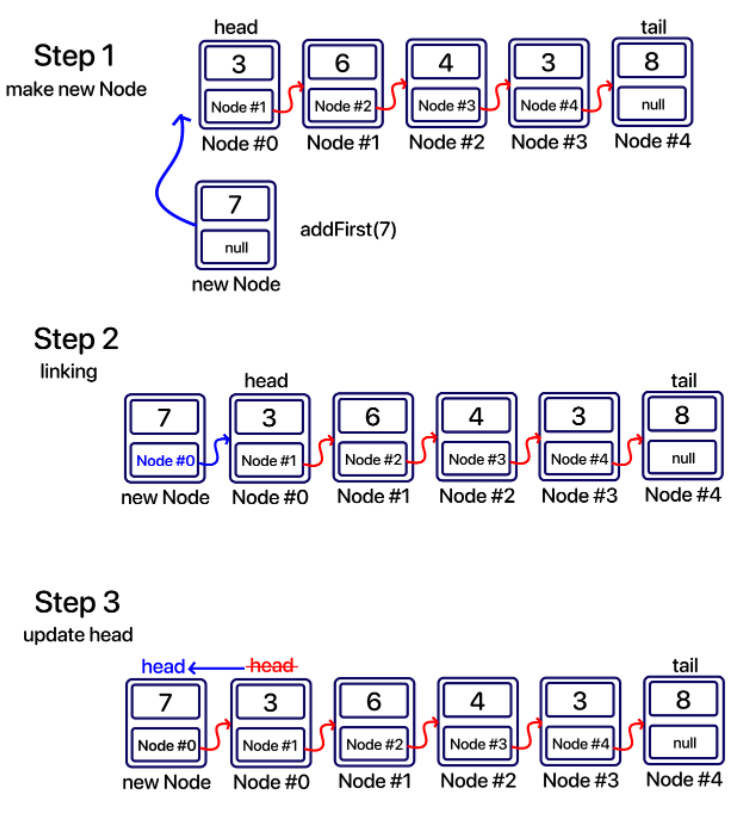
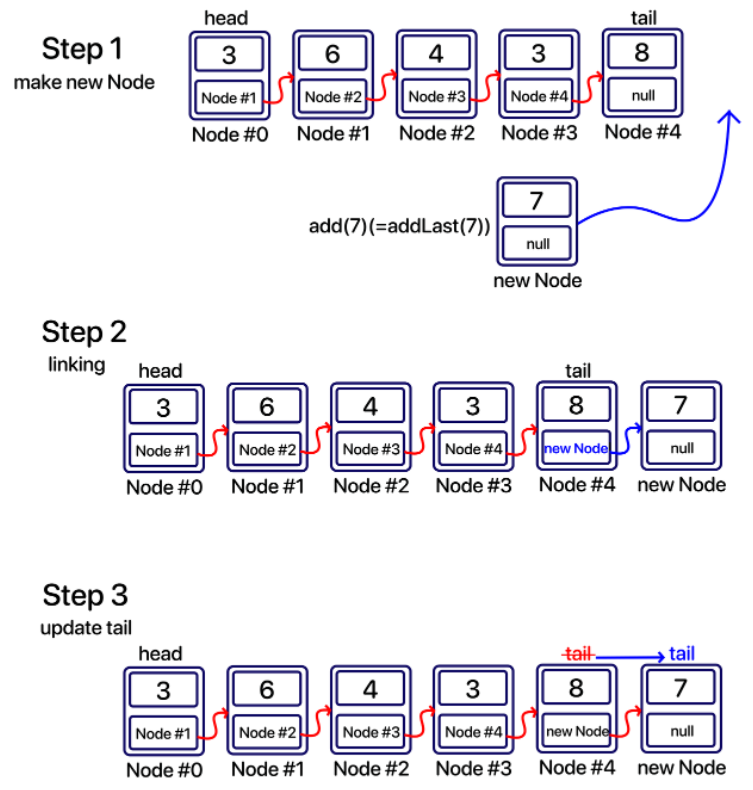
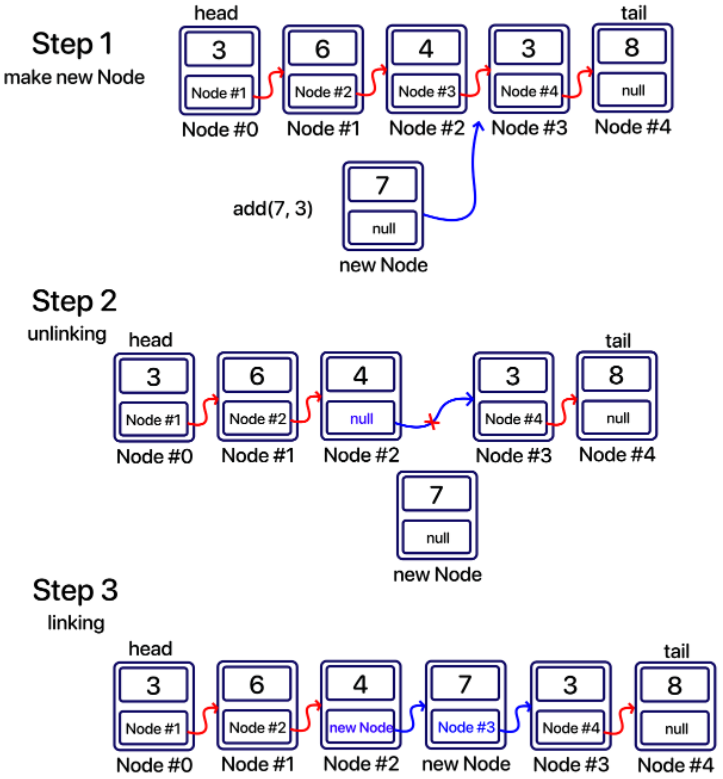
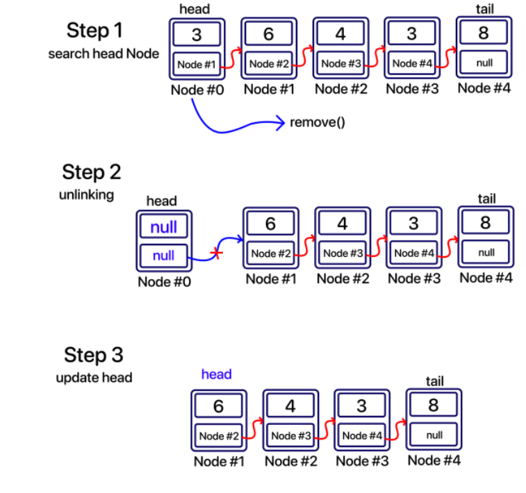
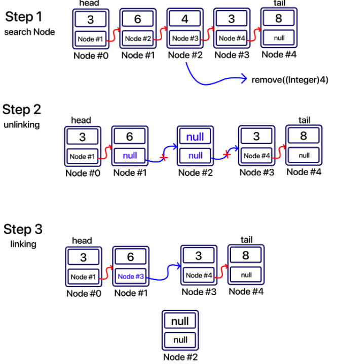

## Singly LinkedList
- LinkedList의 경우 ArrayList와 가장 큰 차이점이라 한다면 바로 '노드'라는 객체를 이용하여 연결한다는 것이다.  
ArrayList의 경우 최상위 타입인 오브젝트 배열(Object[])을 사용하여 데이터를 담아두었다면, 
LinkedList는 배열을 이용하는 것이 아닌 하나의 객체를 두고 그 안에 데이터와 다른 노드를 가리키는 레퍼런스 데이터로 구성하여 여러 노드를 하나의 체인(chain)처럼 연결하는 것이다.
- 데이터와 다른 노드를 가리킬 주소 데이터를 담을 객체가 필요하다고 했다. 그리고 우리는 이 것을 <B style="color:Yellow">"노드(Node)"</B> 라고 부른다.  
이 <B style="color:yellow">Node</B>가 가장 기초적 단위이다.

- 노드 하나의 구조를 보자면 아래와 같다.  

  
  
그리고 위 구조에서 사용자가 저장할 데이터는 data 변수에 담기고, reference 데이터(참조 데이터)는 다음에 연결할 노드를 가리키는 데이터가 담긴다.
우와 같은 노드들이 여러개가 연결되어 있는 것을 연결 리스트, 즉 <B style="color:Orange">LinkedList</B> 라고 한다.  
  
아래는 배열과 LinkedList를 그림으로 비교한 것이다.  

  

위 그림에서 처럼 각각 레퍼런스 변수는 다음 노드객체를 가리키고 있다. 이렇게 단방향으로 연결된 리스트를 <B>LinkedList</B> 중에서도 <B style="color:Orange">Singly LinkedList</B> 라고 하는 것이다.  
  
위와 같이 노드들을 연결 시킨 형태가 바로 <B style="color:orange">LinkedList </B>이다.  
  
이렇게 연결된 노드들에서 '삽입'을 한다면 링크만 바꿔주면 되기 때문에 매우 편리하며, 반대로 '삭제'를 한다면 삭제 할 노드에 연결된 이전 노드에서 링크를 끊고 삭제할 노드의 다음 노드를 연결해주면 된다.

- 추가 add 관련
- 
일반(addLast) 삽입 관련
- 
- 특정 위치에 노드 삽입
- 
- 맨 앞 node 삭제

- 특정 위치에 node remove 
- 
- 특정 요소 삭제
- 

---
SinglyLinkedList 에 대한 기본적인 메소드들이다.
기본적으로 자바에서 제공하고 있는 LinkedList는 양방향 연결 리스트이다.
모단일 연결 리스트의 경우 삽입, 삭제, 과정에서 '링크'만 끊어주면 되기 때문에 매우 효율적이라고 볼 수 있었다.
반대로 모든 자료를 인덱스가 아닌 head부터 연결되어 관리하기 때문에 색인(access)능력은 떨어진다.
결과적으로 이전에 구현했던 ArrayList와 이번에 구현한 LinkedList의 쓰이는 용도가 다르다는 것을 알 수가 있다.  
  
'삽입,삭제'가 빈번한 경우 LinkedList를 쓰는 것이 좋고, 데이터 접근이 주를 이룰 경우엔 ArrayList가 좋다.
두 자료구조의 시간 복잡도는 다음과 같다.  
  
 추기, 삭제에서 '색인(access)'과정은 별도로 본다.  
 
 |작업|메소드|ArrayList|LinkedList|
 |---|-----|---------|----------|
 |add at last index | add()| O(1) |O(1)|
|add at given index| add(index, value)|O(N)|O(1)|
|remove by index|remove(index)|O(N)|O(1)|
|remove by value|remove(value)|O(N)|O(1)|
|get by index|get(index)|O(1)|O(N)|
search by value|indexOf(value)|O(N)|O(N)|

 